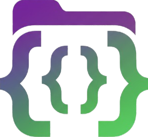

# CopyBox - Secure Code Repository

**CopyBox** is a secure and interactive web-based code repository designed for students to access and copy course-specific code files. It supports multiple courses, modules, and exercises, providing a simple, user-friendly interface for managing coding resources efficiently.

---

## Features

- **Student Authentication:** Secure login using Full Name and USN (University Serial Number).  
- **Dark & Light Modes:** Toggle between dark and light themes for comfortable coding.  
- **Course Management:** Browse multiple courses with chapter and module selection.  
- **File Management:** View and copy code files directly to the clipboard.  
- **Notifications:** Real-time notifications for actions like file copied successfully or errors.  
- **Responsive Design:** Fully responsive UI for desktops, tablets, and mobile devices.  
- **Security Features:**  
  - Right-click context menu disabled.  
  - Developer tools restricted to prevent unauthorized access.  

---

## Supported Courses

1. **Data Visualization With Python**
   - Files: `VTU-8.txt`, `VTU-10.txt`  
   - Directly accessible without chapter/module selection.

2. **Programming in C++: A Hands-on Introduction**
   - Organized by **Chapter (1-4)** and **Module (1-4)**  
   - Each module contains 5 exercises by default (except `chapter2_module2` which has 2 exercises).  
   - Exercises can be copied directly from the repository.

---

## Project Structure

